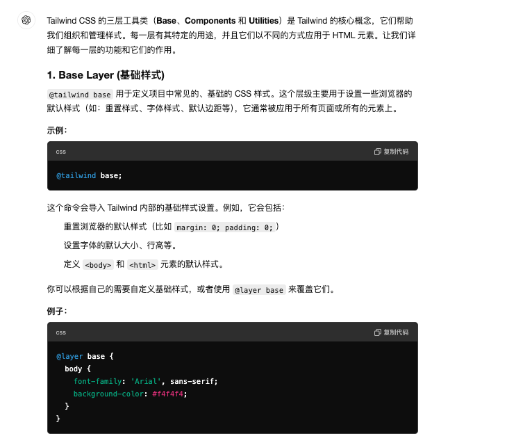
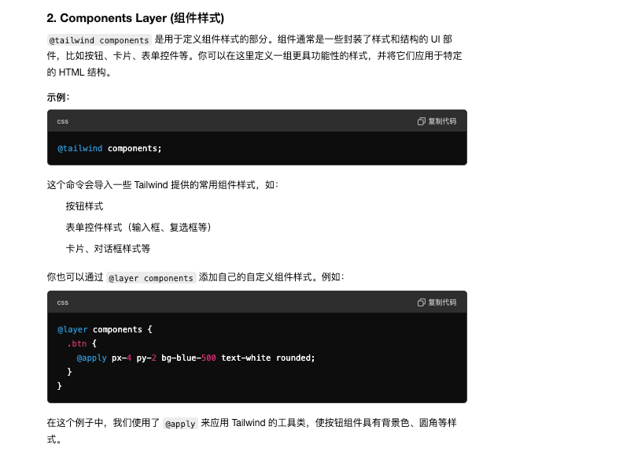
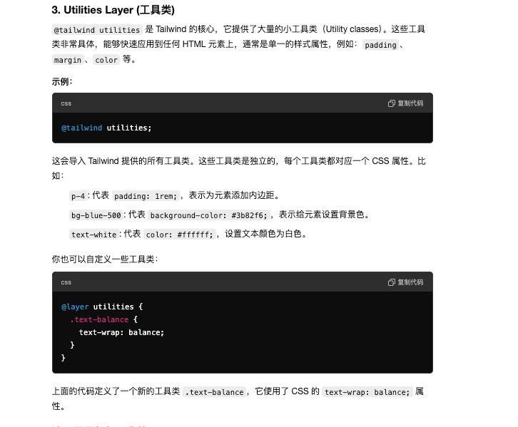
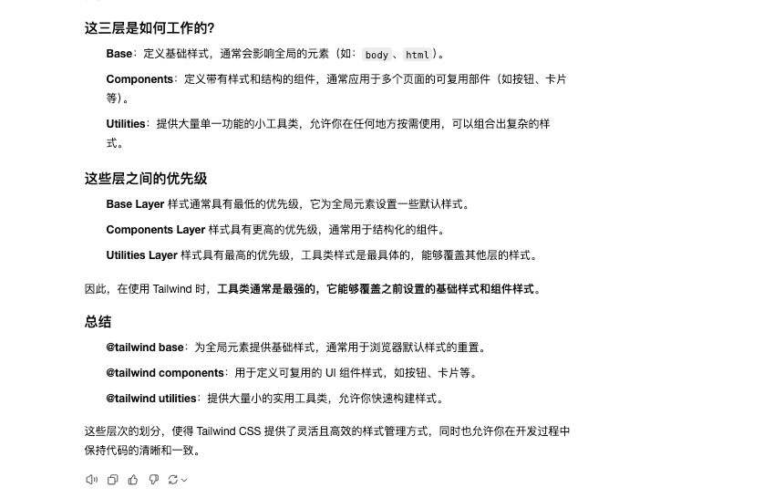

This is a [Next.js](https://nextjs.org) project bootstrapped with [`create-next-app`](https://nextjs.org/docs/app/api-reference/cli/create-next-app).

## Getting Started

First, run the development server:

```bash
npm run dev
# or
yarn dev
# or
pnpm dev
# or
bun dev
```

Open [http://localhost:3000](http://localhost:3000) with your browser to see the result.

You can start editing the page by modifying `app/page.tsx`. The page auto-updates as you edit the file.

This project uses [`next/font`](https://nextjs.org/docs/app/building-your-application/optimizing/fonts) to automatically optimize and load [Geist](https://vercel.com/font), a new font family for Vercel.

## Learn More

To learn more about Next.js, take a look at the following resources:

- [Next.js Documentation](https://nextjs.org/docs) - learn about Next.js features and API.
- [Learn Next.js](https://nextjs.org/learn) - an interactive Next.js tutorial.

You can check out [the Next.js GitHub repository](https://github.com/vercel/next.js) - your feedback and contributions are welcome!

## Deploy on Vercel

The easiest way to deploy your Next.js app is to use the [Vercel Platform](https://vercel.com/new?utm_medium=default-template&filter=next.js&utm_source=create-next-app&utm_campaign=create-next-app-readme) from the creators of Next.js.

Check out our [Next.js deployment documentation](https://nextjs.org/docs/app/building-your-application/deploying) for more details.

# 目录结构介绍
打印四级目录，排除不需要的文件夹
```shell
tree -L 4 -I "node_modules|.git|.next|readme里面的图片"
```
```shell
├── README.md
├── next-env.d.ts
├── next.config.mjs
├── package-lock.json
├── package.json
├── postcss.config.mjs
├── src                               // 这个src目录是可选的，添加src目录更符合传统项目的规范
│   └── app                           // app路由，内部每一个文件夹下的page.tsx都是路由组建，且文件夹名字作为文件名
│       ├── favicon.ico
│       ├── fonts
│       │   ├── GeistMonoVF.woff
│       │   └── GeistVF.woff
│       ├── globals.css                //全局样式文件,里面有针对tailwindcss样式做引入，增强
│       ├── layout.tsx                 //全局布局，依赖全局样式
│       ├── page.tsx                   //app路由下的根路由，对应“/”路由，依赖全局布局
│       └── tailwind                   //自定义路由，路由路径为 “/tailwind”，内部可以有layout.tsx，self.css等局部布局和css
│           └── page.tsx               // “/tailwind”路由的具体组建
├── tailwind.config.ts                 //这个配置文件用于定义 Tailwind CSS 的一些全局设置，包括要处理的文件路径、主题配置以及插件
└── tsconfig.json

```
##  目录说明
* nextJs 中的静态资源都需要放在项目的根目录中的`/public`文件夹，这样nextJs可以直接通过路径访问
* 如果静态资源在其他目录下，则需要通过import的方式导入，nextJs才能访问
* 根目录下的`/src`文件夹是可选的，添加这个目录可能更符合传统的习惯


***
# tailwind css 中文教程
https://tailwind.org.cn/docs/guides/nextjs
***
# Tailwind CSS 的三层工具类
> Base、Components 和 Utilities




